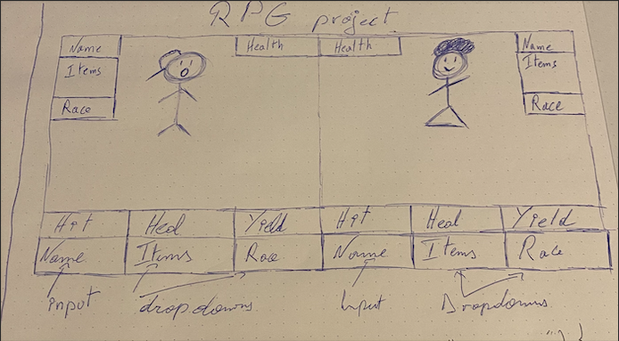

# js-rpg

## Github page

- Hit the link below to see the project page
- [Github page](https://alexg-rgb.github.io/js-rpg/)

## Project

- Solo project

- Create a RPG game using javascript

## Goals

- Understand DOM manipulation

- Understand forms input

- Understand JSON

- Understand basic javascript

## Code

- HTML5

- CSS3

- Javascript vanilla

- Markdown

## Website sketch

## Images credit

- All the images are rights free and come from  [Pixabay](https://pixabay.com/fr/)